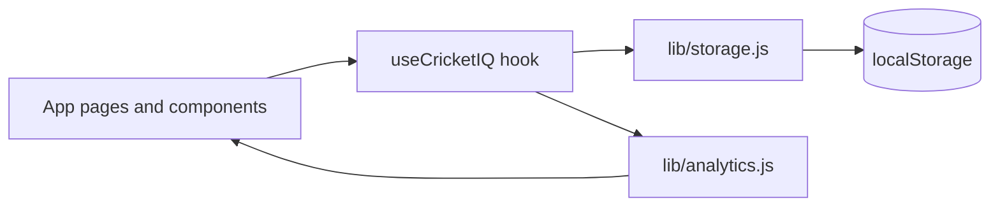

# CricketIQ architecture

CricketIQ is a **Next.js App Router** application with **client-side state** and **no backend database** in the MVP. All persistence is `localStorage`; analytics run in the browser.

## High-level data flow

## Directory map

| Path | Responsibility |
|------|------------------|
| `app/` | Routes (dashboard, players, matches, rankings, best XI, predictor, impact, about) |
| `components/` | Shared UI (`AppShell`, cards, charts) |
| `lib/analytics.js` | Batting, bowling, fielding, consistency, rankings, roles, Best XI, match predictor |
| `lib/storage.js` | Serialize players and matches to `localStorage` |
| `lib/sampleData.js` | Seed dataset for instant demos |
| `lib/csv.js` | CSV export helpers |
| `lib/useCricketIQ.js` | Client hook wiring storage + derived analytics |

## Analytics pipeline

1. **Ingest** raw per-match player rows (runs, balls, wickets, economy inputs, fielding).
2. **Aggregate** career totals and per-match distributions (for consistency).
3. **Compute raw impact signals** (batting, bowling, fielding, clutch).
4. **Normalize** comparable metrics across the squad so scores stay on a 0–100 scale.
5. **Blend** into the published **CricketIQ score** using the documented weights.

## Deployment

Production builds are static-friendly and deploy cleanly to **Vercel**. See [DEPLOYMENT.md](./DEPLOYMENT.md).
